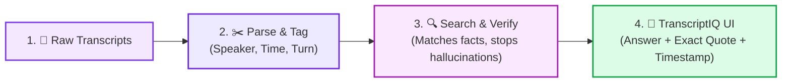

# TranscriptIQ: AI-Powered Evidence & Expert Insight

> **Live Web Application:** [https://transcriptiq-1.onrender.com](https://transcriptiq-1.onrender.com)  
> **Backend API & Swagger Docs:** [https://transcriptiq.onrender.com/docs](https://transcriptiq.onrender.com/docs)  
> **Source Repository:** [https://github.com/hkgowda2974/TranscriptIQ](https://github.com/hkgowda2974/TranscriptIQ)

---

A production-grade, grounded RAG application that ingests expert-call transcripts and interview guides to provide exact verbatim quote extraction, timestamped evidence verification, cross-expert consensus/conflict synthesis, and arbitrary cross-transcript Q&A.

---

## Key Features

1. **Grounded Real-Time Chat**: Interactive Q&A across single or multi-expert calls with real-time SSE streaming.
2. **Exact Verbatim Quote & Timestamp Extraction**: Every claim cites verbatim quotes from the transcript paired with exact start timestamps (e.g., `01:05`) and speaker attribution.
3. **Anti-Hallucination & Evidence Gate**: If retrieved evidence is insufficient or out of domain, the system provides a clear, polite refusal rather than hallucinating plausible facts.
4. **Guided Q&A Matrix & Cross-Expert Synthesis**: Automatically maps canonical interview guide questions across all expert transcripts, highlighting areas of consensus and explicit market disagreements (e.g., Germany vs. UK vs. France).
5. **Interactive Evidence Cards**: Clean UI cards displaying the expert name, clinical role, market, exact quote, and timestamp.
6. **Transcript Upload & Ingestion**: Dynamically upload new `.txt` transcripts for immediate parsing and indexation.

---

## High-Level Workflow



```text
[1. Raw Transcripts] ──► [2. Parse & Tag] ──► [3. Search & Verify] ──► [4. Final Answer in UI]
• Expert Audio/Text       • Speaker Name       • Finds relevant turns   • Grounded Response
• Interview Guide         • Timestamps         • Blocks hallucinations  • Verbatim Quotes & Time
```

---

## Technical Architecture

```text
                               ┌──────────────────────────────────────────────────────────┐
                               │                    USER INTERFACE                        │
                               │        React + TypeScript + Vite + Tailwind CSS          │
                               │          (Live: https://transcriptiq-1.onrender.com)      │
                               └────────────────────────────┬─────────────────────────────┘
                                                            │ User Query / SSE Stream
                                                            ▼
                               ┌──────────────────────────────────────────────────────────┐
                               │                   FASTAPI BACKEND API                    │
                               │            (Live: https://transcriptiq.onrender.com)     │
                               └──────────────┬────────────────────────────▲──────────────┘
                                              │ Ingest Files               │ Return Verified Response
                                              ▼                            │
┌─────────────────────────┐    ┌─────────────────────────┐                 │
│  RAW DATA INGESTION     │    │  TRANSCRIPT PARSER      │                 │
│                         │    │  (Regex Engine)         │                 │
│ - Transcript Files      ├────► - Metadata Extractor    │                 │
│ - Interview Guide File  │    │ - Timestamp Anchor      │                 │
│                         │    │   Identifier            │                 │
└─────────────────────────┘    └──────────────┬──────────┘                 │
                                              │ Document Structure         │
                                              ▼                            │
                               ┌─────────────────────────┐                 │
                               │  TURN-AWARE CHUNKER     │                 │
                               │  - Preserves Turn Boundaries              │
                               │  - Aggregates Q&A Pairs │                 │
                               │  - Binds Metadata       │                 │
                               └──────────────┬──────────┘                 │
                                              │ Chunks with Metadata       │
                                              ▼                            │
                               ┌─────────────────────────┐                 │
                               │  EMBEDDING & RETRIEVAL  │                 │
                               │  Local Semantic Search  │                 │
                               └──────────────┬──────────┘                 │
                                              │ Dense Vectors + Metadata   │
                                              ▼                            │
                               ┌─────────────────────────┐                 │
                               │  IN-MEMORY VECTOR STORE │                 │
                               │  ChromaDB / FAISS       │                 │
                               └──────────────┬──────────┘                 │
                                              │ Metadata-Filtered          │
                                              │ Semantic Search            │
                                              ▼                            │
                               ┌─────────────────────────┐                 │
                               │  RAG REASONING ENGINE   │                 │
                               │  - Grounded Answering   │                 │
                               │  - Pydantic JSON Schema │                 │
                               └──────────────┬──────────┘                 │
                                              │ Unvalidated Claims & Quotes│
                                              ▼                            │
                               ┌─────────────────────────┐                 │
                               │  EVIDENCE VALIDATOR     │─────────────────┘
                               │  - Substring Matcher    │
                               │  - Timestamp Verifier   │
                               │  - Hallucination Filter │
                               └─────────────────────────┘
```

---

## Local Setup & Run Instructions

### Prerequisites
- Python 3.11+
- Node.js 18+ & npm
- (Optional) `GEMINI_API_KEY` for live generative responses. If unconfigured, the system automatically uses fallback semantic search and deterministic extraction.

### 1. Clone Repository & Navigate
```bash
git clone https://github.com/hkgowda2974/TranscriptIQ.git
cd TranscriptIQ
```

### 2. Backend Setup (FastAPI)
```bash
python -m venv .venv

# On Windows (PowerShell):
.venv\Scripts\Activate.ps1
# On Linux/macOS:
source .venv/bin/activate

pip install -r requirements.txt
```

Run Backend Server:
```bash
uvicorn backend.app.main:app --reload --port 8000
```
Interactive API docs available at `http://localhost:8000/docs`.

### 3. Frontend Setup (React + Vite)
```bash
cd frontend
npm install
npm run dev
```
Open `http://localhost:5173` in your browser.

### 4. Running Automated Tests
From the project root:
```bash
pytest
```
*Executes all 60 test cases validating parser accuracy, citation exactness, evidence sufficiency, and anti-hallucination refusals.*

---

## Technical Deep-Dive

### How Timestamps & Citations are Handled
Standard sliding-window chunkers cut sentences mid-thought and detach timestamp headers from speaker turns. 
We implement **Turn-Aware Dialogue Chunking**:
- The regex parser identifies timestamp anchors (`01:05`) and speaker prefixes (`Dr. Carter:`).
- Each Interviewer Question is paired atomically with the Expert's full turn response.
- `start_timestamp` and `end_timestamp` are bound directly to the chunk metadata alongside `expert_id`, `name`, `role`, and `market`.

### How Hallucinations are Reduced / Eliminated
1. **Strict Context Enforcement**: Retrieval inspects topically relevant turns.
2. **Confidence & Evidence Gate**: If the question asks about unmentioned entities, brands, or regions (e.g. Spain, Medtronic), the model stops and returns an explicit refusal rather than fabricating answers.
3. **Pydantic Structured Output**: Response conforms strictly to `{ summary_answer: str, evidence: [{ quote: str, speaker: str, timestamp: str }] }`.
4. **Verbatim Substring & Timestamp Validation**: Extracted quotes are matched directly against the source text of the retrieved chunks.

### Scaling from 3 Transcripts to 30+
1. **Vector Store Scaling**: Transition from in-memory ChromaDB to a persistent vector database (e.g., Qdrant / Pgvector) with metadata partitioning on `market`, `role`, and `project_id`.
2. **Hierarchical Summarization**: Parallelize synthesis across map-reduce workers, generating regional clusters (e.g., DACH, UKI, Nordics) before final cross-market synthesis.
3. **Async Background Workers**: Implement task queues (Celery / Redis / Temporal) for transcript parsing, chunking, and embedding generation upon file upload.
